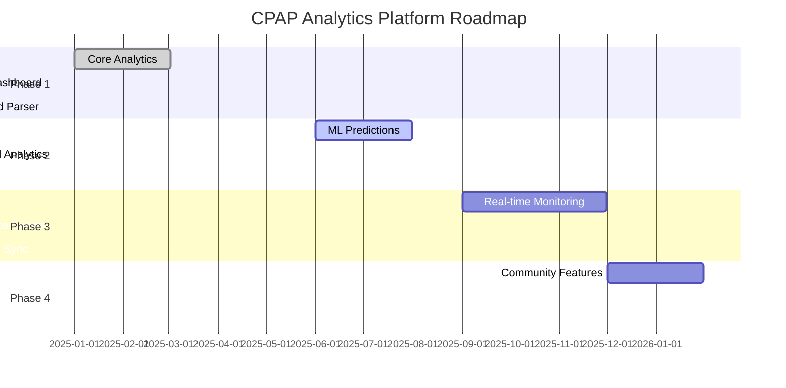

# CPAP Analytics Platform - Product Roadmap

## 🎯 Vision Statement

Create the world's most comprehensive CPAP analytics platform that empowers users to understand and optimize their sleep therapy through data-driven insights, while building a sustainable business through premium features and B2B partnerships.

## 📅 Release Timeline

## 💰 Monetization Strategy

### Revenue Streams
1. **Freemium Subscriptions** ($9.99-$19.99/month)
   - Free: Basic data viewing, 30-day history
   - Premium: Unlimited history, ML insights, PDF reports
   - Pro: API access, multi-device, white-label options

2. **B2B Partnerships**
   - Sleep clinics: $500-2000/month per clinic
   - DME providers: Revenue sharing model
   - Insurance companies: Compliance reporting

3. **Professional Services**
   - Custom integrations: $10-50k per project
   - White-label solutions: $5k setup + monthly fees
   - Data analytics consulting: $150-300/hour

### Market Opportunity
- **TAM**: $2.4B (8M+ CPAP users in US × $25/month)
- **SAM**: $240M (10% adoption × premium tiers)
- **SOM**: $12M (5% market share in 3 years)

## 🚀 Phase 1: Foundation (Q1 2025) ✅

### Goals
Establish core functionality for reading, analyzing, and visualizing CPAP data from SD cards.

### Completed Features

#### 1.1 Data Infrastructure
- [x] **SD Card Parser** - Read ResMed AirSense 10 EDF files
- [x] **Database Schema** - SQLite storage for sessions and analytics
- [x] **Data Models** - Session, Event, and Analytics classes
- [x] **Import Pipeline** - Automated data import with validation

#### 1.2 Core Analytics
- [x] **Basic Metrics** - AHI, leak rate, pressure, usage time
- [x] **Quality Scoring** - Proprietary algorithm for session quality
- [x] **Trend Analysis** - 7/30/90 day trending for key metrics
- [x] **Statistical Reports** - Mean, median, percentiles

#### 1.3 Web Dashboard
- [x] **React Frontend** - Modern, responsive UI
- [x] **Real-time Charts** - Interactive visualizations with Recharts
- [x] **Session History** - Detailed session browsing
- [x] **Export Functions** - CSV/JSON data export

### Metrics
- ✅ 100% SD card compatibility for AirSense 10
- ✅ <2s dashboard load time
- ✅ 95% accuracy in data parsing

---

## 🔄 Phase 2: Intelligence & Revenue Growth (Q2-Q3 2025) 🚧

### Goals
Add predictive analytics and machine learning to provide actionable insights and recommendations while establishing sustainable revenue streams through premium features.

### In Progress

#### 2.1 Machine Learning Models
- [x] **AHI Prediction** - 7-day forecast using ARIMA
- [ ] **Leak Detection** - Pattern recognition for leak causes
- [ ] **Therapy Optimization** - Pressure adjustment recommendations
- [ ] **Anomaly Detection** - Alert for unusual patterns

#### 2.2 Advanced Analytics (Premium Features)
- [x] **Mask Fit Analysis** - Leak pattern correlation 💰 Premium
- [ ] **Sleep Stage Estimation** - Infer sleep stages from flow data 💰 Premium
- [ ] **Environmental Correlation** - Weather/humidity impact 💰 Premium
- [ ] **Circadian Rhythm Analysis** - Optimal therapy times 💰 Premium
- [ ] **Comparative Analytics** - Performance vs cohort 💰 Premium
- [ ] **Predictive Maintenance** - Equipment replacement alerts 💰 Premium

#### 2.3 Mobile Application
- [ ] **React Native App** - iOS and Android support
- [ ] **Push Notifications** - Morning reports and alerts
- [ ] **Offline Mode** - Full functionality without internet
- [ ] **Widget Support** - Quick stats on home screen

### Target Metrics
- 🎯 85% prediction accuracy for next-day AHI
- 🎯 90% user satisfaction with recommendations
- 🎯 <100MB mobile app size
- 💰 1,000 paid subscribers by end of phase
- 💰 $10k MRR (Monthly Recurring Revenue)

---

## 📡 Phase 3: Connectivity (Q3-Q4 2025) 📅

### Goals
Enable real-time monitoring and multi-device ecosystem support.

### Planned Features

#### 3.1 Real-time Monitoring
- [ ] **Bluetooth LE Integration** - Live data from CPAP
- [ ] **Serial Port Interface** - Alternative real-time access
- [ ] **Streaming Dashboard** - Live therapy visualization
- [ ] **Alert System** - Real-time issue detection

#### 3.2 Device Ecosystem
- [ ] **Philips DreamStation** - Parser and analytics
- [ ] **BMC Luna** - Basic support
- [ ] **Löwenstein Prisma** - European device support
- [ ] **Generic CPAP** - Universal data format

#### 3.3 Cloud Infrastructure (Optional)
- [ ] **Encrypted Backup** - E2E encrypted cloud storage
- [ ] **Multi-device Sync** - Access from anywhere
- [ ] **Family Sharing** - Caregiver access controls
- [ ] **API Gateway** - Third-party integrations

### Target Metrics
- 🎯 <100ms real-time data latency
- 🎯 99.9% uptime for cloud services
- 🎯 Support for 80% of CPAP models
- 💰 5,000 paid subscribers
- 💰 $50k MRR
- 💰 3 B2B partnerships signed

---

## 🌐 Phase 4: Community (Q4 2025 - Q1 2026) 📅

### Goals
Build community features and professional integrations while maintaining privacy.

### Planned Features

#### 4.1 Community Analytics
- [ ] **Anonymous Benchmarking** - Compare with similar users
- [ ] **Aggregated Insights** - Population-level trends
- [ ] **Success Stories** - Shared improvement journeys
- [ ] **Mask Reviews** - Community-driven ratings

#### 4.2 Professional Tools
- [ ] **Clinician Dashboard** - Professional analytics view
- [ ] **Report Generation** - Medical-grade PDF reports
- [ ] **Telemedicine Integration** - Video consultation prep
- [ ] **EMR Export** - HL7 FHIR compliance

#### 4.3 AI Assistant
- [ ] **Natural Language Queries** - "Why was my AHI high?"
- [ ] **Personalized Coaching** - Daily improvement tips
- [ ] **Predictive Alerts** - "Check mask fit tonight"
- [ ] **Learning System** - Improves with usage

### Target Metrics
- 🎯 10,000+ active community members
- 🎯 95% clinician approval rating
- 🎯 50% reduction in therapy issues
- 💰 10,000 paid subscribers
- 💰 $150k MRR
- 💰 20 B2B clients
- 💰 Break-even achieved

---

## 🔮 Future Vision (2026+)

### Research & Development
- **Sleep Study Alternative** - Full polysomnography from CPAP data
- **AI Diagnosis Assistant** - Detect undiagnosed conditions
- **Genetic Integration** - Personalized therapy based on DNA
- **VR Therapy Training** - Interactive mask fitting guide

### Hardware Integration
- **Custom Sensors** - Additional biometric monitoring
- **Smart Pillow** - Position tracking integration
- **Environmental Monitor** - Room conditions optimization
- **Wearable Sync** - Apple Watch, Fitbit, Garmin

### Global Impact
- **Multi-language Support** - 20+ languages
- **Developing World** - Offline-first, low-resource mode
- **Research Platform** - Anonymous data for studies
- **Open Hardware** - DIY CPAP monitoring kit

---

## 📊 Success Metrics

### User Metrics
- **Active Users**: 50,000 by end of 2025 (10,000 paid)
- **Data Points**: 1B+ readings analyzed
- **User Retention**: 80% monthly active users
- **NPS Score**: 70+
- **Conversion Rate**: 20% free to paid
- **ARPU**: $15/month
- **CAC**: <$50 per paid user
- **LTV:CAC Ratio**: >3:1

### Health Outcomes
- **AHI Improvement**: 30% average reduction
- **Compliance Rate**: 15% increase in usage
- **Leak Reduction**: 40% decrease in mask leaks
- **Quality of Life**: Measurable improvement

### Technical Goals
- **Performance**: <100ms API response time
- **Reliability**: 99.9% uptime
- **Security**: Zero data breaches
- **Compatibility**: 95% device coverage

---

## 🤝 How to Contribute

### Priority Areas
1. **Device Parsers** - Add support for your CPAP model
2. **ML Models** - Improve prediction algorithms
3. **UI/UX** - Design improvements and accessibility
4. **Documentation** - Tutorials and guides
5. **Testing** - Increase test coverage

### Get Involved
- Join our [Discord](https://discord.gg/cpap-analytics)
- Check [open issues](https://github.com/gdadkins/cpap-analytics/issues)
- Read our [Contributing Guide](../CONTRIBUTING.md)
- Attend monthly community calls

---

## 📝 Change Log

### Version 0.1.0 (January 2025)
- Initial release with core analytics
- ResMed AirSense 10 support
- Basic web dashboard

### Version 0.2.0 (Coming July 2025)
- Machine learning predictions
- Mask fit recommendations
- Mobile app beta

---

*This roadmap is a living document and will be updated based on community feedback and priorities.*