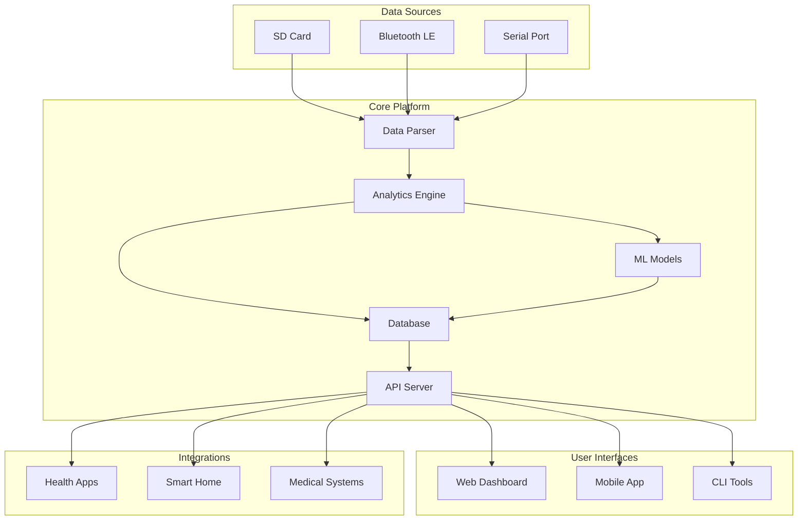

# CPAP Analytics Platform Wiki

Welcome to the comprehensive guide for the CPAP Analytics Platform. This wiki covers everything from basic setup to advanced development topics.

## 📚 Wiki Navigation

### Getting Started
- [**Home**](Home.md) - Project overview and quick links
- [**Introduction**](Introduction.md) - Why we built this platform
- [**Quick Start Guide**](Quick-Start.md) - Get running in 5 minutes
- [**FAQ**](FAQ.md) - Frequently asked questions

### User Documentation
- [**Installation Guide**](Installation-Guide.md) - Detailed setup instructions
  - [Windows Setup](Installation-Windows.md)
  - [macOS Setup](Installation-macOS.md)
  - [Linux Setup](Installation-Linux.md)
  - [Docker Installation](Installation-Docker.md)
- [**User Manual**](User-Manual.md) - Complete usage guide
  - [Dashboard Overview](Dashboard-Overview.md)
  - [Importing Data](Importing-Data.md)
  - [Understanding Metrics](Understanding-Metrics.md)
  - [Generating Reports](Generating-Reports.md)
- [**Troubleshooting**](Troubleshooting.md) - Common issues and solutions

### Technical Documentation
- [**Architecture Overview**](Architecture.md) - System design and components
- [**API Reference**](API-Reference.md) - REST API documentation
  - [Authentication](API-Authentication.md)
  - [Endpoints](API-Endpoints.md)
  - [Data Models](API-Models.md)
  - [Examples](API-Examples.md)
- [**Database Schema**](Database-Schema.md) - Table structures and relationships
- [**Data Formats**](Data-Formats.md) - CPAP file format specifications
  - [ResMed EDF](Format-ResMed-EDF.md)
  - [Philips SleepWorks](Format-Philips.md)
  - [Universal Format](Format-Universal.md)

### Developer Guide
- [**Development Setup**](Development-Setup.md) - Set up your dev environment
- [**Code Structure**](Code-Structure.md) - Project organization
- [**Contributing Guide**](Contributing.md) - How to contribute
- [**Testing Guide**](Testing.md) - Writing and running tests
- [**Plugin Development**](Plugin-Development.md) - Extend functionality
- [**Style Guide**](Style-Guide.md) - Code conventions

### Analytics & ML
- [**Analytics Engine**](Analytics-Engine.md) - How analytics work
- [**Machine Learning Models**](ML-Models.md) - Prediction algorithms
  - [AHI Prediction](ML-AHI-Prediction.md)
  - [Leak Detection](ML-Leak-Detection.md)
  - [Therapy Optimization](ML-Optimization.md)
- [**Custom Metrics**](Custom-Metrics.md) - Creating new analytics

### Integrations
- [**Health Platforms**](Health-Integrations.md)
  - [Apple Health](Integration-Apple-Health.md)
  - [Google Fit](Integration-Google-Fit.md)
  - [Samsung Health](Integration-Samsung-Health.md)
- [**Smart Home**](Smart-Home-Integrations.md)
  - [Home Assistant](Integration-Home-Assistant.md)
  - [IFTTT](Integration-IFTTT.md)
- [**Medical Systems**](Medical-Integrations.md)
  - [HL7 FHIR](Integration-FHIR.md)
  - [EMR Systems](Integration-EMR.md)

### Advanced Topics
- [**Real-time Monitoring**](Realtime-Monitoring.md) - Bluetooth/Serial setup
- [**Security & Privacy**](Security.md) - Encryption and data protection
- [**Performance Tuning**](Performance.md) - Optimization guide
- [**Deployment Guide**](Deployment.md) - Production deployment
- [**Backup & Recovery**](Backup-Recovery.md) - Data management

### Community
- [**Community Guidelines**](Community-Guidelines.md) - Code of conduct
- [**Success Stories**](Success-Stories.md) - User testimonials
- [**Research Projects**](Research-Projects.md) - Academic collaborations
- [**Roadmap Discussion**](Roadmap-Discussion.md) - Future planning

---

## 🏗️ Architecture Diagram



## 📖 Sample Wiki Pages

### Home.md
```markdown
# CPAP Analytics Platform

Welcome to the official wiki for the CPAP Analytics Platform - an open-source solution for advanced CPAP therapy analysis.

## Quick Links
- 🚀 [Quick Start Guide](Quick-Start.md) - Get started in 5 minutes
- 📊 [User Manual](User-Manual.md) - Complete usage guide
- 🛠️ [Developer Guide](Development-Setup.md) - Contributing to the project
- 💬 [Community Forum](https://forum.cpap-analytics.org)

## What is CPAP Analytics Platform?
A comprehensive, privacy-focused analytics platform that transforms your CPAP data into actionable insights...
```

### Architecture.md
```markdown
# Architecture Overview

The CPAP Analytics Platform follows a modular, microservices-inspired architecture designed for scalability, maintainability, and privacy.

## Core Components

### 1. Data Ingestion Layer
Responsible for reading and parsing data from various CPAP devices...

### 2. Analytics Engine
The heart of the platform, processing raw data into meaningful metrics...

### 3. Machine Learning Pipeline
Provides predictive analytics and personalized recommendations...

## Data Flow
1. **Import**: User uploads SD card or connects device
2. **Parse**: Data parser extracts structured data
3. **Process**: Analytics engine calculates metrics
4. **Store**: Database persists results
5. **Analyze**: ML models generate predictions
6. **Present**: UI displays insights
```

---

## 📁 Repository Structure

```
cpap-analytics/
├── .github/
│   ├── ISSUE_TEMPLATE/
│   ├── workflows/
│   └── CODEOWNERS
├── docs/
│   ├── wiki/
│   ├── api/
│   └── images/
├── src/
│   ├── backend/
│   │   ├── parsers/
│   │   ├── analytics/
│   │   ├── ml/
│   │   └── api/
│   ├── frontend/
│   │   ├── components/
│   │   ├── pages/
│   │   └── utils/
│   └── mobile/
├── tests/
├── scripts/
├── docker/
├── .vscode/
│   ├── settings.json
│   ├── launch.json
│   └── extensions.json
├── README.md
├── CONTRIBUTING.md
├── LICENSE
└── package.json
```

## 🛠️ VS Code Configuration

### Recommended Extensions
```json
{
  "recommendations": [
    "ms-python.python",
    "ms-python.vscode-pylance",
    "dbaeumer.vscode-eslint",
    "esbenp.prettier-vscode",
    "bradlc.vscode-tailwindcss",
    "ms-azuretools.vscode-docker",
    "eamodio.gitlens",
    "mhutchie.git-graph",
    "yzhang.markdown-all-in-one",
    "bierner.markdown-mermaid",
    "streetsidesoftware.code-spell-checker"
  ]
}
```

### Workspace Settings
```json
{
  "editor.formatOnSave": true,
  "python.linting.enabled": true,
  "python.linting.pylintEnabled": true,
  "python.formatting.provider": "black",
  "python.testing.pytestEnabled": true,
  "eslint.validate": ["javascript", "javascriptreact", "typescript", "typescriptreact"],
  "tailwindCSS.experimental.classRegex": [
    ["clsx\\(([^)]*)\\)", "(?:'|\"|`)([^']*)(?:'|\"|`)"]
  ]
}
```

---

## 📝 Documentation Standards

### Markdown Style Guide
- Use ATX-style headers (`#` not underlines)
- Include TOC for documents > 3 sections
- Use mermaid diagrams for architecture
- Include code examples with syntax highlighting
- Add images with descriptive alt text

### Code Documentation
- Python: Google-style docstrings
- JavaScript/TypeScript: JSDoc comments
- API: OpenAPI 3.0 specification
- Database: Inline SQL comments

### Version Control
- Semantic versioning (MAJOR.MINOR.PATCH)
- Conventional commits
- Changelog maintenance
- Git flow branching model

---

*This wiki is continuously updated. Last revision: May 2025*